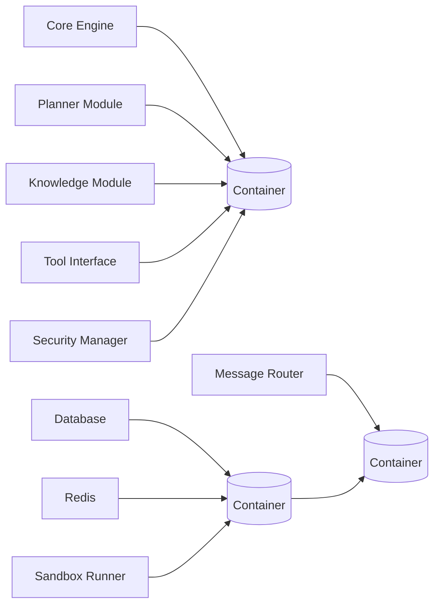

graph TD
    A[Development] --> B[CI Pipeline]
    B --> C{Deployment Target}
    C --> D[Local Development]
    C --> E[Test Environment]
    C --> F[Staging Environment]
    C --> G[Production Environment]
```

## Containerization Strategy


## Deployment Process
1. **Build Phase**:
   - Compile code (if needed)
   - Create Docker images
   - Scan for vulnerabilities

2. **Test Phase**:
   - Run unit tests
   - Execute integration tests
   - Perform security scans

3. **Deploy Phase**:
   - Push to container registry
   - Update Kubernetes manifests
   - Apply configuration changes

4. **Verify Phase**:
   - Run health checks
   - Validate metrics collection
   - Monitor logs for errors

5. **Rollback Plan**:
   - Maintain previous version
   - Keep rollback manifests ready
   - Monitor post-deployment stability

## Configuration Management
```yaml
# Example configuration structure
core:
  log_level: "INFO"
  max_concurrent_tasks: 10

planner:
  max_plan_depth: 5
  pseudocode_format: "numbered"

security:
  sandbox:
    memory_limit: "512MB"
    cpu_limit: "1.0"
    network: "restricted"

monitoring:
  metrics_enabled: true
  log_retention_days: 30
```

## Monitoring and Observability
1. **Metrics Collection**:
   - System resource usage
   - Request latency and throughput
   - Error rates by component

2. **Logging**:
   - Structured JSON logging
   - Centralized log aggregation
   - Real-time monitoring dashboard

3. **Health Checks**:
   - Liveness endpoints
   - Readiness probes
   - Dependency health verification