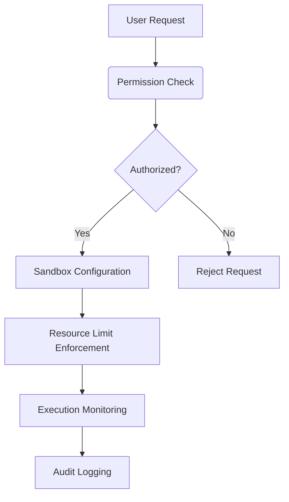

graph TD
    A[User Input] --> B(Message Router)
    B --> C{Event Type}
    C -->|Planning| D[Planner Module]
    C -->|Tool Use| E[Tool Interface Layer]
    C -->|Knowledge| F[knowledge Module]
    D --> G[Update Execution Plan]
    E --> H[Execute Tool in Sandbox]
    F --> I[Retrieve Knowledge]
    G --> J[Result Submitter]
    H --> J
    I --> J
    J --> K[User Output]
```

## Data Integration Strategies
### Priority-Based Information Handling
1. **Datasource APIs**: Highest priority (authoritative sources)
2. **Web Search Results**: Medium priority (current information)
3. **Internal Knowledge**: Lowest priority (system-provided context)

### Data Validation Pipeline
1. Source verification
2. Content validation against schema
3. Cross-reference checking
4. Trust score calculation
5. Contextual relevance filtering

## Security Integration Patterns
### Multi-Layer Security Enforcement


## Tool Integration Strategies
### Standardized Tool Adapter Pattern
1. Input validation and sanitization
2. Security context check
3. Execution in restricted environment
4. Output processing and transformation
5. Result delivery with context preservation