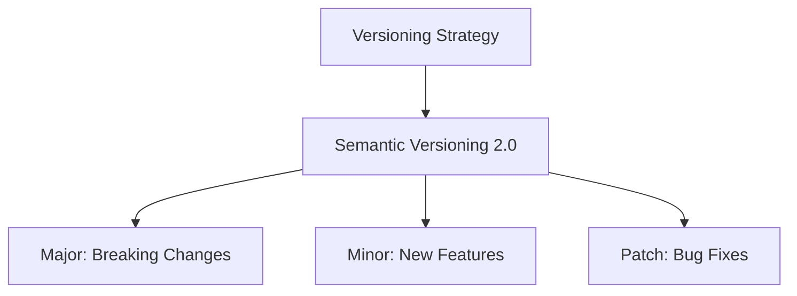
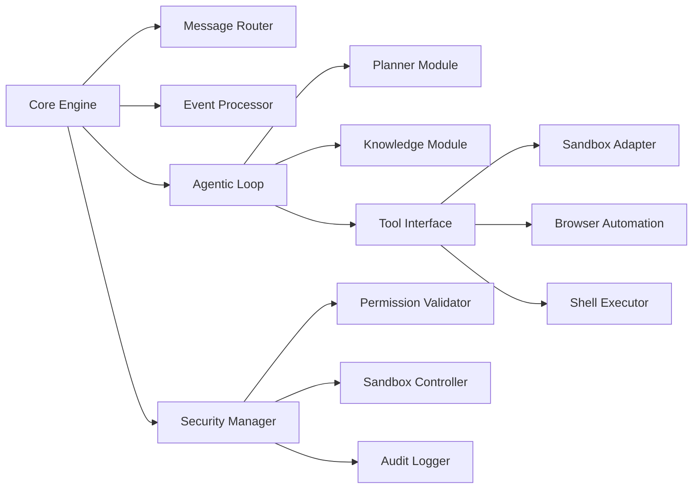

# Dependency Management Strategy

## Dependency Types
1. **Direct Dependencies**: Explicitly required by components
2. **Transitive Dependencies**: Required by dependencies
3. **Development Dependencies**: Used for testing and tooling
4. **Runtime Dependencies**: Needed only in production

## Versioning Strategy

## Dependency Resolution Process
1. **Declaration**: Specify dependencies in component manifests
2. **Resolution**: Determine compatible versions using resolver
3. **Locking**: Create lock file with resolved versions
4. **Installation**: Install dependencies in isolated environment
5. **Verification**: Check integrity of installed packages

## Dependency Graph

## Dependency Update Policy
1. **Critical Security Updates**: Immediate update (within 24h)
2. **High Priority Bug Fixes**: Update within 7 days
3. **New Features**: Evaluate during planning phase
4. **Minor Updates**: Include in next scheduled maintenance
5. **Major Updates**: Plan dedicated upgrade task

## Isolation Strategy
1. **Component Isolation**: Each module has own dependency scope
2. **Environment Separation**: Development, testing, production environments
3. **Version Locking**: Lock dependencies in production builds
4. **Conflict Resolution**: Use explicit version overrides