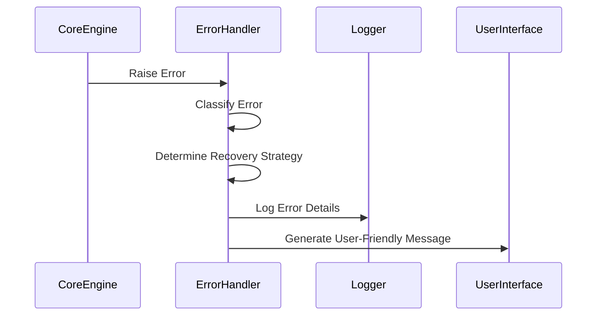

graph TD
    A[Error Types] --> B[User-Facing Errors]
    A --> C[System Errors]
    A --> D[Security Errors]
    
    B --> E[Validation Errors]
    B --> F[Usage Errors]
    B --> G[Business Logic Errors]
    
    C --> H[Infrastructure Errors]
    C --> I[Network Errors]
    C --> J[Resource Errors]
    
    D --> K[Permission Errors]
    D --> L[Sandbox Violations]
    D --> M[Security Policy Errors]
```

## Error Handling Architecture


## Error Response Format
```json
{
  "error": {
    "type": "string",  // Error type (validation, system, security)
    "code": "string",  // Machine-readable error code
    "message": "string",  // Human-readable description
    "details": {  // Optional additional information
      "field": "string",  // Field in error (for validation)
      "value": "any",  // Value that caused the error
      "suggestion": "string"  // Suggested fix
    },
    "timestamp": "datetime"  // When error occurred
  }
}
```

## Recovery Strategies
1. **Automatic Recovery**:
   - Retry operations with exponential backoff
   - Failover to backup systems
   - Resource reallocation

2. **User Intervention Required**:
   - Request input for ambiguous situations
   - Ask for confirmation on alternative approaches
   - Notify about required permissions

3. **Safe Failure**:
   - Rollback to previous state
   - Enter degraded mode
   - Save progress before termination