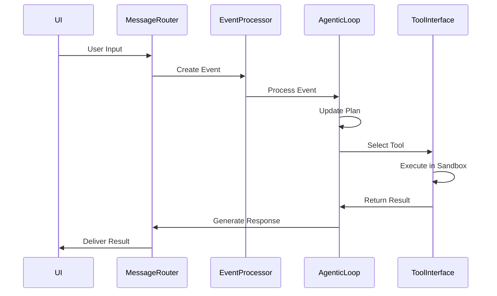

class EventType(Enum):
    USER_MESSAGE = "user_message"
    TOOL_ACTION = "tool_action"
    EXECUTION_RESULT = "execution_result"
    PLAN_UPDATE = "plan_update"
    ERROR_EVENT = "error"
    SYSTEM_STATUS = "system_status"
```

## Event Processing Flow


## Event Prioritization
1. **User Messages**: Highest priority (immediate processing)
2. **Execution Results**: High priority (timely feedback)
3. **System Events**: Medium priority (status updates)
4. **Background Tasks**: Low priority (non-critical operations)