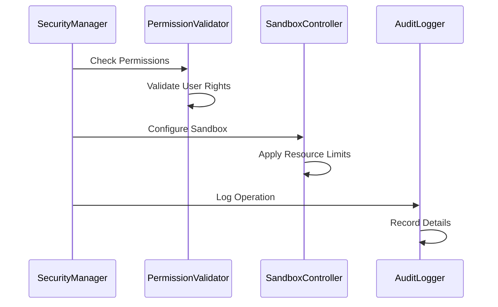
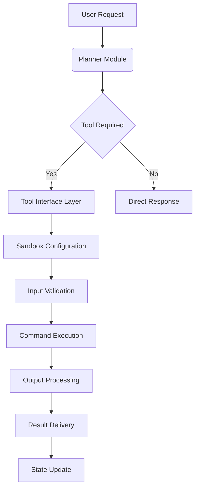

sequenceDiagram
    participant UI
    participant MessageRouter
    participant EventProcessor
    participant AgenticLoop
    participant Planner
    participant Knowledge
    participant ToolInterface
    
    UI->>MessageRouter: User Input
    MessageRouter->>EventProcessor: Create Event
    EventProcessor->>AgenticLoop: Process Event
    AgenticLoop->>Planner: Update Plan
    Planner->>Planner: Generate Pseudocode
    AgenticLoop->>Knowledge: Retrieve Context
    Knowledge->>Knowledge: Search Memory
    AgenticLoop->>ToolInterface: Execute Tool
    ToolInterface->>ToolInterface: Sandbox Execution
    ToolInterface->>AgenticLoop: Return Result
    AgenticLoop->>MessageRouter: Generate Response
    MessageRouter->>UI: Deliver Result
```

## Security Component Interactions


## Data Flow for Tool Execution


## State Management Flow
```mermaid
sequenceDiagram
    participant StateManager
    participant StateTracker
    participant StateStorage
    
    StateManager->>StateTracker: Register State Change
    StateTracker->>StateTracker: Validate Change
    StateTracker->>StateManager: Approve Change
    StateManager->>StateStorage: Persist State
    StateStorage->>StateStorage: Store in Database
    StateManager->>StateTracker: Confirm Persistence