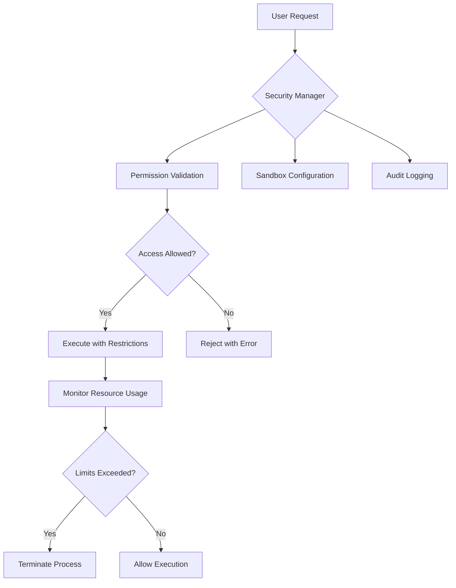

# Manus AI Clone Security Requirements

## Core Security Principles
1. **Least Privilege**: All operations run with minimal required permissions
2. **Defense in Depth**: Multiple security layers for critical components
3. **Security by Design**: Security considerations integrated from initial design
4. **Fail Securely**: System fails to secure state on errors

## Component-Specific Requirements
### Code Execution Sandbox
- Process isolation using Docker containers
- Resource limits (CPU, memory, execution time)
- Network access control (no outbound by default)
- File system restrictions (read-only except tmp)

### Tool Interface Layer
- Operation validation before execution
- Command sanitization for shell tools
- Permission checks for all tool accesses
- Audit logging of all tool executions

### Data Protection
- Encryption at rest for stored data
- TLS 1.3+ for all network communication
- JWT-based authentication tokens
- Role-based access control (RBAC) system

## Security Enforcement Architecture

## Compliance Requirements
- OWASP Top 10 protections
- GDPR compliance for user data
- SOC 2 Type II readiness
- ISO/IEC 27001 controls implementation