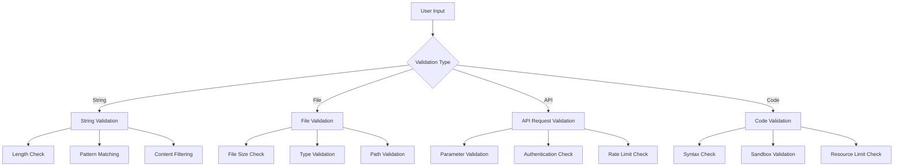

# Security Validation Procedures

## Component Security Checks
### Tool Interface Validation
1. **Command Validation**:
   - Block prohibited commands (rm, mkfs, etc.)
   - Validate parameter formats
   - Check command length limits

2. **Permission Validation**:
   - Verify user permissions for requested operation
   - Check tool access rights
   - Validate file/directory access permissions

3. **Resource Validation**:
   - Confirm available memory/cpu for execution
   - Validate sandbox configuration
   - Check network access requirements

## Input Validation Framework

## Security Audit Process
1. **Pre-Execution Checks**:
   - Validate all inputs and parameters
   - Check permissions and access controls
   - Configure sandbox environment

2. **Execution Monitoring**:
   - Track resource usage (CPU, memory)
   - Monitor system call patterns
   - Log all operations and outputs

3. **Post-Execution Analysis**:
   - Review execution logs for anomalies
   - Check for unexpected behavior patterns
   - Update threat intelligence database