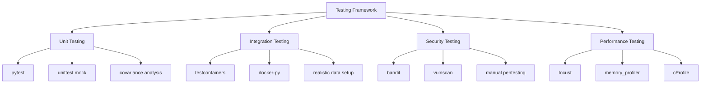
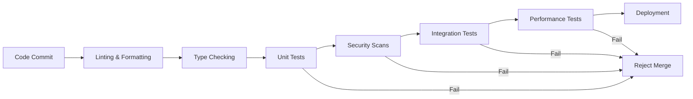

# Testing Strategy for Manus AI Clone

## Testing Approach
We follow a comprehensive testing strategy with the following layers:

### 1. Unit Testing
- Test individual components in isolation
- Use pytest with async support
- 100% code coverage target
- Focus on core algorithms and business logic

### 2. Integration Testing
- Test component interactions
- Validate event stream processing
- Verify tool interface compatibility
- Test security validation flows

### 3. Security Testing
- Penetration testing
- Vulnerability scanning
- Permission validation tests
- Sandbox escape attempts simulation

### 4. Performance Testing
- Load testing under heavy usage
- Stress testing resource limits
- Latency measurement for critical paths
- Concurrency testing

## Testing Framework

## CI/CD Pipeline Structure

## Error Handling Testing
1. **Invalid Input Testing**:
   - Test all boundary conditions
   - Try invalid data types
   - Attempt format violations

2. **Failure Scenario Testing**:
   - Simulate resource exhaustion
   - Create network failures
   - Induce database errors

3. **Security Boundary Testing**:
   - Attempt privilege escalation
   - Test command injection vectors
   - Verify sandbox restrictions